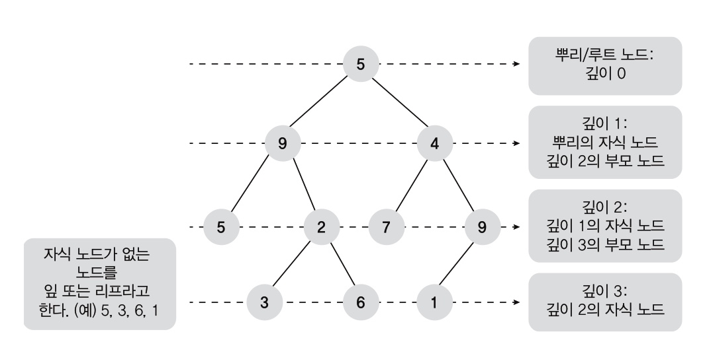
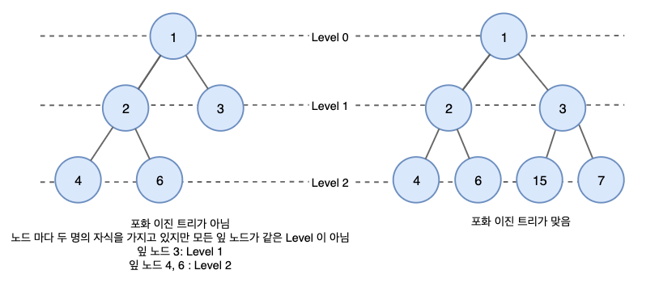
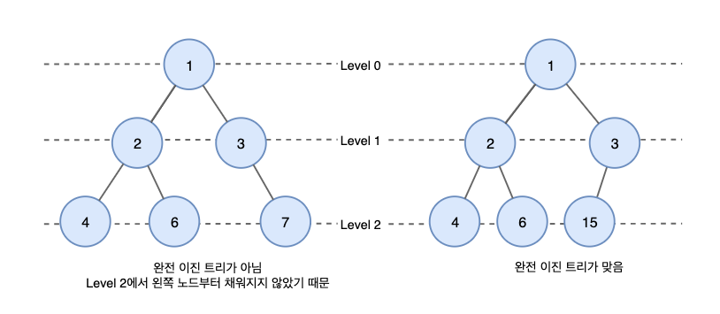
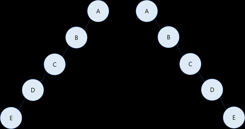
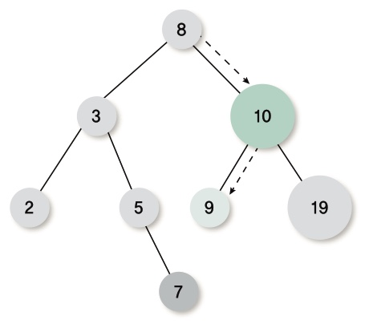
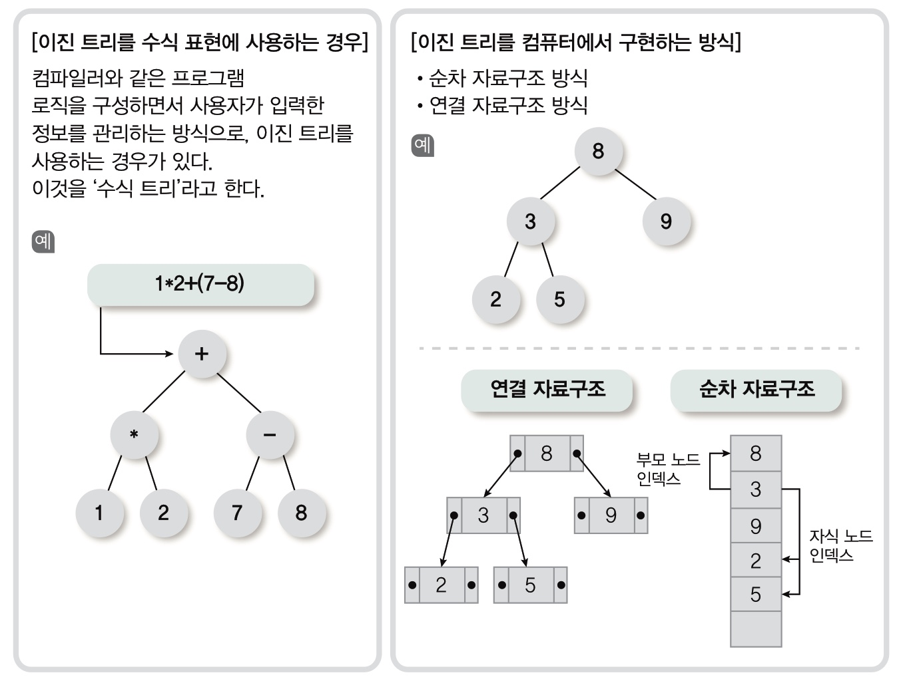

# 트리(Tree) 자료구조
- 임의의 노드에서 다른 노드로의 경로가 하나 밖에 없는 것

- 노드 중에서 단 하나의 루트 노드(Root Node)가 있고, 루트 노드에서 하위 노드(Sub Node)들이 연결된 `비선형 계층 구조`
- 구현은 배열이나 연결 리스트 사용
- 운영체제의 파일 시스템에서 사용 

## 이진 트리(Binary Tree)
- 모든 노드가 최대 2개의 자식 노드를 가질 수 있는 구조

- 왼쪽 서브 트리의 값은 루트의 값보다 작음
- 오른쪽 서브 트리의 값은 루트의 값보다 큼
- 주로 빠른 검색이 필요한 곳에서 사용하므로, '이진 검색 트리'라고도 함

### 분류
1. 포화 이진 트리(Full Binary Tree) : 레벨의 노드가 꽉 차 있는 트리

2. 완전 이진 트리(Complete Binary Tree) : 마지막 레벨 전까지는 노드가 꽉 차 있고, 마지막 레벨의 왼쪽에서 오른쪽으로 노드가 채워져 있는 트리(마지막 레벨이 다 채워지지 않아도 됨)

3. 편향 이진 트리(Skewed Binary Tree) : 왼쪽 혹은 오른쪽 서브 트리만을 가지는 트리

### 사용(입력, 검색, 삭제)

- 이진 트리에 7이 새로 입력되는 경우

          - 8보다 작으므로, 왼쪽
          - 3보다 크므로, 오른쪽
          - 5보다 크므로, 오른쪽에 위치시킴

- 이진 트리에서 특정 값을 찾는 경우 ex) 9를 찾는다면,

          - 8보다 크므로, 오른쪽
          - 10보다 작으므로, 왼쪽에 있음

- 이진 트리에서 특정 값을 지우는 경우 ex) 1-을 지우면,

          - 9가 10의 자리로 올라감
          - 19가 9보다 크므로 9의 오른쪽에 위치함

> Note
          
          이진 트리는 잘못 구성되면 한쪽에 노드가 몰리는 현상이 발생함. 만약, 8을 지우는 경우에는 특정 노드를 후계자로 임의 선정하여 8의 위치에 놓고, 나머지 노드를 앞에서 설명한 방법에 의해 재배치함

### 응용

