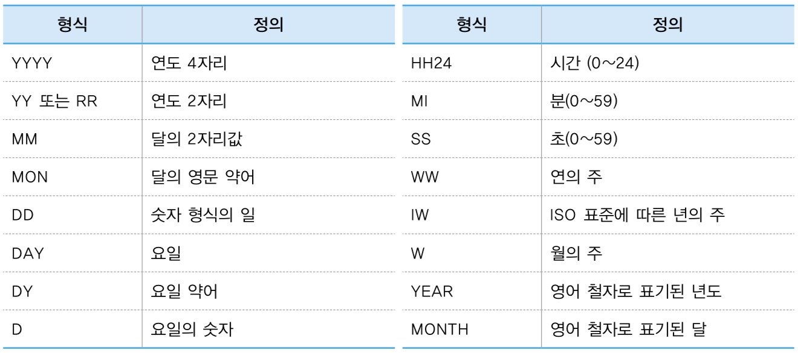
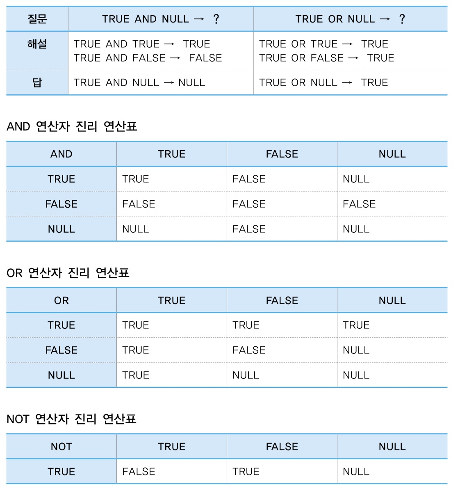

# SELECT문

## 📌컬럼 별칭(Alias)을 사용하여 출력되는 컬럼명 변경하기
- SELECT의 결과 테이블에만 적용
- 같이 사용 가능한 별명(X) > 개명(O)
- `컬럼명 AS 별명`

```sql
SELECT empno as 사원번호, ename as 사원이름
FROM emp;
```

### ✅더블 쿼테이션("") 마크를 감싸줘야 하는 경우

1. 대소문자를 구분하여 출력할 때

2. 공백문자를 출력할 때

3. 특수문자를 출력할 때($, _, #만 가능)

### ✅Oracle에서 '와 "의 차이

- 컬럼명을 쓸 때는 쌍따옴표, 문자열은 홑따옴표

> 수식에 컬럼 별칭을 사용하면 ORDER BY절에 수식명을 작성하지 않고 컬럼 별칭만 사용하면 되기 때문에 SQL 작성이 간편해짐
```sql
SELECT ename, sal * (12 + 3000) as 월급
FROM emp
ORDER BY 월급 desc;
```
```sql
SELECT c.name,
       c.capital,
       c.population
FROM tblCountry c;
```

## 📌연결 연산자 사용하기(||)
- 컬럼과 컬럼을 서로 연결해서 출력할 수 있음
- 컬럼과 문자열을 연결해서 출력할 수 있음
```sql
SELECT name || capital
FROM tblCountry;
```
```sql
SELECT ename || '의 월급은' || sal || '입니다' as 월급정보
FROM emp;
```

## 📌중복된 데이터를 제거해서 출력하기(DISTINCT)
- 컬럼명 앞에 DISTINCT를 작성하고 실행하면 중복행이 제거되고 UNIQUE한 값만 출력이 됨
```sql
SELECT DISTINCT job
FROM emp;
```
- DISTINCT 대신 UNIQUE를 사용해도 됨
```sql
SELECT UNIQUE job
FROM emp;
```

## 📌데이터를 정렬해서 출력하기(ORDER BY)
- 오름차순 ASC
- 내림차순 DESC
- SQL 작성 시에도 `맨 마지막`에 `작성`하고 오라클이 실행할 때도 `맨 마지막`에 `실행`함
- 테이블에 존재하는 모든 필드는 정렬 기준으로 사용할 수 있음
```sql
SELECT ename, sal
FROM emp
ORDER BY sal;
```
> 컬럼을 여러 개 작성할 수도 있음 <br>
1차 정렬 기준이 같으면 2차 기준으로 정렬
```sql
SELECT ename, sal
FROM emp
ORDER BY deptno asc, sal desc;
```
> 컬럼명 대신 숫자를 적어줄 수도 있음
```sql
SELECT ename, deptno, sal
FROM emp
ORDER BY 2 asc, 3 desc;
```
💡
관계형 DB에서 레코드의 물리적인 순서는 큰 의미가 없다. 대신 출력할 때 ORDER BY 절로 정렬 순서를 원하는대로 지정함. 레코드가 어디쯤에 저장되어 있건 출력할 때 가장 보기좋은 형태로 순서를 정하면 됨

## 📌WHERE절 - 숫자 데이터 검색
> 월급이 3000인 사원들의 이름, 월급, 직업을 출력해라.
```sql
SELECT ename, sal, job
FROM emp
WHERE sal = 3000;
```
- 검색하기 원하는 조건을 WHERE절에 작성하여 데이터를 검색
- 실행 순서
          
          1. FROM 테이블
          2. WHERE 조건
          3. SELECT 컬럼리스트(대부분 마지막)

### ✅ WHERE절의 검색 조건으로 사용하는 비교 연산자
- 비교 연산자

| 연산자 | 의미        |
| ------ | ----------- |
| >      | 크다        |
| <      | 작다        |
| >=     | 크거나 같다 |
| <=     | 작거나 같다 |
| =      | 같다        |
| <>     | 같지 않다   |

- 기타 비교 연산자

| 연산자                    | 의미                          |
| ------------------------- | ----------------------------- |
| BETWEEN 최소값 AND 최대값 | ~ 사이에 있는                 |
| LIKE                      | 일치하는 문자 패턴 검색       |
| IS NULL                   | NULL 값인지 여부              |
| IN                        | 값 리스트 중 일치하는 값 검색 |


```sql
SELECT ename as 이름, sal as 월급
FROM emp
WHERE 월급 >= 3000;
```

💡 오류 발생 - 오라클이 SQL을 실행하는 실행 순서 때문에
- emp 테이블에서 한글로 된 '월급'컬럼을 찾아보았지만 없기 때문에

| 코딩순서 | SQL                               | 실행순서 | SQL                               |
| -------- | --------------------------------- | -------- | --------------------------------- |
| 1        | SELECT ename as 이름, sal as 월급 | 3        | SELECT ename as 이름, sal as 월급 |
| 2        | FROM emp                          | 1        | FROM emp                          |
| 3        | WHERE 월급 >= 3000;               | 2        | WHERE 월급 >= 3000;               |

## 📌WHERE절 - 문자와 날짜 검색
```sql
SELECT *
FROM tblInsa
WHERE buseo = '영업부';
```
- 문자를 검색할 때는 문자 양쪽에 싱글 쿼테이션 마크(' ')를 둘러 감싸 줘야함
- ' ' 안에 있는 것이 숫자가 아니라 문자라고 오라클에게 알려줌

```sql
SELECT * 
FROM tblinsa
WHERE ibsadate = '2010-01-01';
```
- `날짜도 양쪽에 ' ' 감싸 줘야함`



## 📌산술 연산자
```sql
SELECT ename, sal*12 as 연봉 
FROM emp
WHERE sal*12 >= 36000;
```

## 📌비교 연산자 (BETWEEN AND)
- BETWEEN 최소값 AND 최대값
- 최소값, 최대값 > 포함

> 1000과 3000을 포함하지 않음
```sql
SELECT ename, sal
FROM emp
WHERE sal NOT BETWEEN 1000 AND 3000;
```

## 📌비교 연산자 (LIKE)

| 기호 | 설명                        |
| ---- | --------------------------- |
| %    | 0개 이상의 임의 문자와 일치 |
| <    | 하나의 문자와 일치          |

> 장으로 끝나는 직위
```sql
SELECT * 
FROM tblinsa 
WHERE jikwi LIKE '%장';
```

> 이름이 A 포함
```sql
select * 
from employees 
where first_name like '%a%';
```

> S로 시작하고 a포함
```sql
select * 
from employees 
where first_name like 'S%a%';
```

## 📌비교 연산자 (IN)
```sql
select * 
from tblinsa 
where buseo in ('홍보부', '개발부', '총무부');
```
```sql
select * 
from tblinsa 
where (buseo = '홍보부' or buseo ='개발부' or buseo = '총무부');
```

---

```sql
select * 
from tblinsa 
where buseo not in ('홍보부', '개발부', '총무부');
```
```sql
select * 
from tblinsa 
where (buseo <> '홍보부' and buseo <>'개발부' and buseo <> '총무부');
```

## 📌비교 연산자 (IS NULL)
NULL
- 데이터가 할당되지 않은 상태
- 알수 없는 값

```sql
select ename, comm
from emp
where comm is null;
```

### NULL 함수
- NVL 함수: NULL 데이터를 처리하는 함수
- NVL(필드, 대체값)
  - NVL(comm,0)은 comm을 출력할 때 comm이 NULL이면 0으로 출력하는 함수

- NVL2(필드, 널아닐때의 값, 널일때의 값)

|      | NVL 함수 X                                                | NVL 함수O                                                        |
| ---- | --------------------------------------------------------- | ---------------------------------------------------------------- |
| SQL  | SELECT sal + comm<br> FROM emp <br> WHERE ename = 'KING'; | SELECT sal + NVL(comm,0)<br> FROM emp <br> WHERE ename = 'KING'; |
| 결과 | NULL이 출력됨                                             | 5000                                                             |



## IF문 (DECODE)
> 부서 번호가 10번이면 300, 부서 번호가 20번이면 400, 부서번호가 10번, 20번이 아니면 0
```SQL
SELECT ename, deptno, DECODE(deptno,10,300,20,400,0) as 보너스
FROM emp;
```
```SQL
SELECT ename, mod(empno,2), DECODE(mod(empno,2),0,'짝수',1,'홀수') as 보너스
FROM emp;
```
> 직업이 SALESMAN이면 보너스 5000, 나머지 직업은 보너스 2000
```SQL
SELECT ename, job, DECODE(job, 'SALESMAN', 5000, 2000) as 보너스
FROM emp;
```

## IF문 (CASE)
- DECODE 다른점 : DECODE는 등호(=) 비교만 가능하지만, CASE는 등호(=), 부등호(>=, <=, >, <) 둘 다 가능
```SQL
SELECT ename, job,sal , CASE WHEN sal >= 3000 THEN 500 -- 월급이 3000 이상이면 500
                             WHEN sal >= 2000 THEN 300 -- 월급이 2000 이상이면 300
                             WHEN sal >= 1000 THEN 200 -- 월급이 1000 이상이면 200
                             ELSE  0                   -- 해당 x 0
                        END AS BONUS
  FROM emp
  WHERE job IN ('SALESMAN','ANALYST');
```
