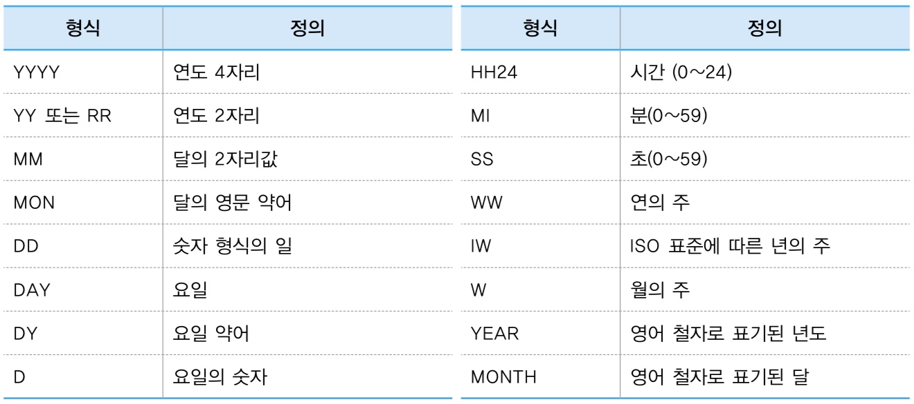

## 📌컬럼 별칭(Alias)을 사용하여 출력되는 컬럼명 변경하기
- SELECT의 결과 테이블에만 적용
- 같이 사용 가능한 별명(X) > 개명(O)
- `컬럼명 AS 별명`

```sql
SELECT empno as 사원번호, ename as 사원이름
FROM emp;
```

### ✅더블 쿼테이션("") 마크를 감싸줘야 하는 경우

1. 대소문자를 구분하여 출력할 때

2. 공백문자를 출력할 때

3. 특수문자를 출력할 때($, _, #만 가능)

> 수식에 컬럼 별칭을 사용하면 ORDER BY절에 수식명을 작성하지 않고 컬럼 별칭만 사용하면 되기 때문에 SQL 작성이 간편해짐
```sql
SELECT ename, sal * (12 + 3000) as 월급
FROM emp
ORDER BY 월급 desc;
```
```sql
SELECT c.name,
       c.capital,
       c.population
FROM tblCountry c;
```

## 📌연결 연산자 사용하기(||)
- 컬럼과 컬럼을 서로 연결해서 출력할 수 있음
- 컬럼과 문자열을 연결해서 출력할 수 있음
```sql
SELECT name || capital
FROM tblCountry;
```
```sql
SELECT ename || '의 월급은' || sal || '입니다' as 월급정보
FROM emp;
```

## 📌중복된 데이터를 제거해서 출력하기(DISTINCT)
- 컬럼명 앞에 DISTINCT를 작성하고 실행하면 중복행이 제거되고 UNIQUE한 값만 출력이 됨
```sql
SELECT DISTINCT job
FROM emp;
```
- DISTINCT 대신 UNIQUE를 사용해도 됨
```sql
SELECT UNIQUE job
FROM emp;
```

## 📌데이터를 정렬해서 출력하기(ORDER BY)
- 오름차순 ASC
- 내림차순 DESC
- SQL 작성 시에도 맨 마지막에 작성하고 오라클이 실행할 때도 맨 마지막에 실행함
```sql
SELECT ename, sal
FROM emp
ORDER BY sal;
```
> 컬럼을 여러 개 작성할 수도 있음
```sql
SELECT ename, sal
FROM emp
ORDER BY deptno asc, sal desc;
```
> 컬럼명 대신 숫자를 적어줄 수도 있음
```sql
SELECT ename, deptno, sal
FROM emp
ORDER BY 2 asc, 3 desc;
```

## 📌WHERE절 - 숫자 데이터 검색
> 월급이 3000인 사원들의 이름, 월급, 직업을 출력해라.
```sql
SELECT ename, sal, job
FROM emp
WHERE sal = 3000;
```
- 검색하기 원하는 조건을 WHERE절에 작성하여 데이터를 검색
- 실행 순서
          
          1. FROM 테이블
          2. WHERE 조건
          3. SELECT 컬럼리스트(대부분 마지막)

### ✅ WHERE절의 검색 조건으로 사용하는 비교 연산자
- 비교 연산자

|연산자|의미|
|------|----|
|>|크다|
|<|작다|
|>=|크거나 같다|
|<=|작거나 같다|
|=|같다|
|<>|같지 않다|

- 기타 비교 연산자

|연산자|의미|
|------|----|
|BETWEEN 최소값 AND 최대값|~ 사이에 있는|
|LIKE|일치하는 문자 패턴 검색|
|IS NULL|NULL 값인지 여부|
|IN|값 리스트 중 일치하는 값 검색|


```sql
SELECT ename as 이름, sal as 월급
FROM emp
WHERE 월급 >= 3000;
```

💡 오류 발생 - 오라클이 SQL을 실행하는 실행 순서 때문에
- emp 테이블에서 한글로 된 '월급'컬럼을 찾아보았지만 없기 때문에

|코딩순서|SQL|실행순서|SQL|
|------|----|----|----|
|1|SELECT ename as 이름, sal as 월급|3|SELECT ename as 이름, sal as 월급|
|2|FROM emp|1|FROM emp
|3|WHERE 월급 >= 3000;|2|WHERE 월급 >= 3000;

## 📌WHERE절 - 문자와 날짜 검색
```sql
SELECT *
FROM tblInsa
WHERE buseo = '영업부';
```
- 문자를 검색할 때는 문자 양쪽에 싱글 쿼테이션 마크('')를 둘러 감싸 줘야함
- '' 안에 있는 것이 숫자가 아니라 문자라고 오라클에게 알려줌

```sql
SELECT * 
FROM tblinsa
WHERE ibsadate = '2010-01-01';
```
- 날짜도 양쪽에 '' 감싸 줘야함


## 📌산술 연산자
```sql
SELECT ename, sal*12 as 연봉 
FROM emp
WHERE sal*12 >= 36000;
```

## 📌비교 연산자 (BETWEEN AND)
- BETWEEN 최소값 AND 최대값
- 최소값, 최대값 > 포함

> 1000과 3000을 포함하지 않음
```sql
SELECT ename, sal
FROM emp
WHERE sal NOT BETWEEN 1000 AND 3000;
```

## 📌비교 연산자 (LIKE)

|기호|설명|
|------|----|
|%|0개 이상의 임의 문자와 일치|
|<|하나의 문자와 일치|

> 장으로 끝나는 직위
```sql
SELECT * 
FROM tblinsa 
WHERE jikwi LIKE '%장';
```

> 이름이 A 포함
```sql
select * 
from employees 
where first_name like '%a%';
```

> S로 시작하고 a포함
```sql
select * 
from employees 
where first_name like 'S%a%';
```

## 📌비교 연산자 (IN)
```sql
select * 
from tblinsa 
where buseo in ('홍보부', '개발부', '총무부');
```
```sql
select * 
from tblinsa 
where (buseo = '홍보부' or buseo ='개발부' or buseo = '총무부');
```

---

```sql
select * 
from tblinsa 
where buseo not in ('홍보부', '개발부', '총무부');
```
```sql
select * 
from tblinsa 
where (buseo <> '홍보부' and buseo <>'개발부' and buseo <> '총무부');
```

## 📌비교 연산자 (IS NULL)
NULL
- 데이터가 할당되지 않은 상태
- 알수 없는 값

||NVL 함수 X|NVL 함수 O|
|------|----|----|
|SQL|SELECT sal + comm<br> FROM emp <br> WHERE ename = 'KING';|SELECT sal + NVL(comm,0)<br> FROM emp <br> WHERE ename = 'KING';|
|결과|NULL이 출력됨|5000|
- NVL 함수: NULL 데이터를 처리하는 함수

          - NVL(comm,0)은 comm을 출력할 때 comm이 NULL이면 0으로 출력하는 함수


