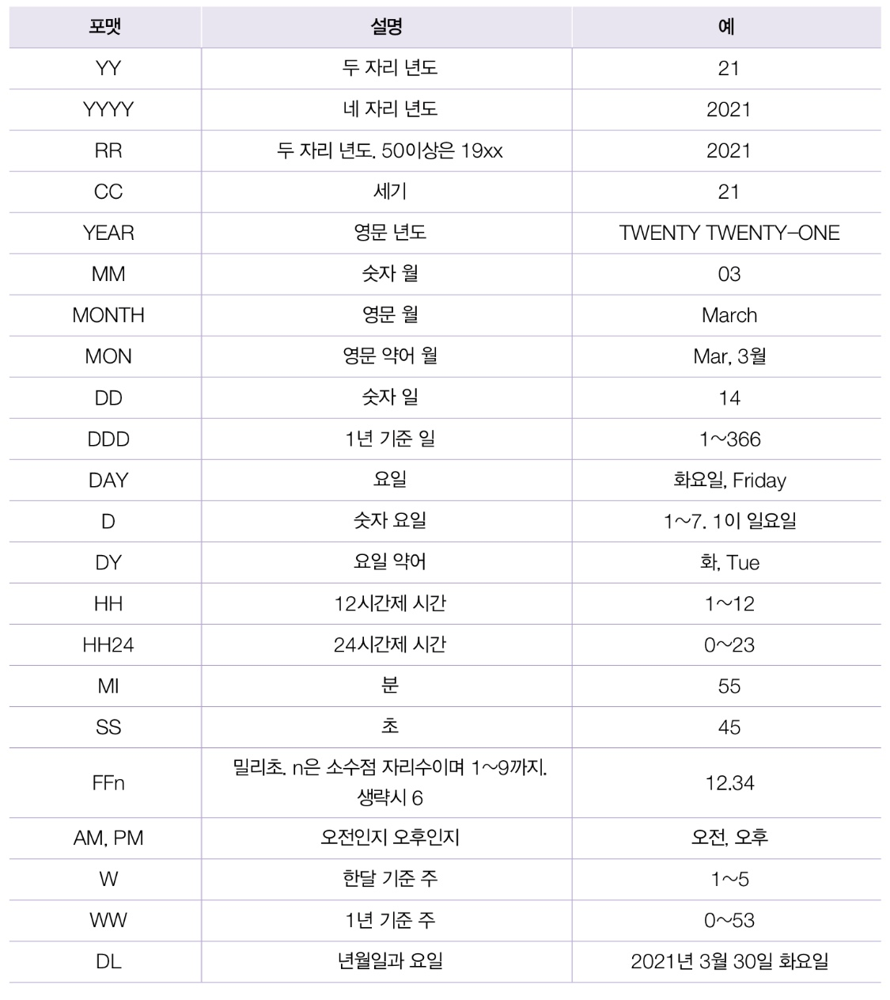

# 함수(Function)
- 다양한 데이터 검색을 위해 필요한 기능
- 출력값을 리턴이라고 하며 `계산 결과가 딱! 하나만 리턴함`

| 함수의 종류  |      | 설명                                              |
| ------------ | ---- | ------------------------------------------------- |
| 단일행 함수  | 정의 | 하나의 행을 입력받아 하나의 행을 반환하는 함수    |
|              | 종류 | 문자함수, 숫자함수, 날짜함수, 변환 함수, 일반함수 |
| 다중 행 함수 | 정의 | 여러 개의 행을 입력받아 하나의 행을 반환하는 함수 |
|              | 종류 | 그룹 함수                                         |


# 📌문자열 함수
## 대소문자 변환 함수(UPPER, LOWER, INITCAP)

- UPPER(s) : 대문자로 변환

- LOWER(s) : 소문자로 변환

- INITCAP(s) : 단어의 첫자만 대문자로 바꾼다

```sql
SELECT
    first_name
FROM
    employees
WHERE
    lower(first_name) LIKE '%an%';
```

💡 오라클은 대소문자를 구분함, 반면 SQL Server와 MariaDB는 문자열의 대소문자를 구분하지 않음

## 문자에서 특정 철차 추출하기(SUBSTR)

- SUBSTR(s, 시작위치, 가져올 문자 개수)

- SUBSTR(s, 1, 가져올 문자 개수) : 왼쪽에서부터 가져옴

- SUBSTR(s, -가져올 문자 개수) : `오른쪽`에서부터 가져옴

💡 SQL은 첨자 1부터 시작!

> MITH
```sql
SELECT SUBSTR('SMITH', 2)
FROM dual;
```

> 금수
```sql
SELECT SUBSTR('아름다운 대한민국 금수강산', -4, 2)
FROM dual;
```

## 문자열의 길이를 출력하기(LENGTH)
> 5
```sql
SELECT length('가나다라마')
FROM dual;
```
- LENGTHB : 바이트의 길이를 반환
> 15 - 한글 3byte
```sql
SELECT lengthb('가나다라마')
FROM dual;
```

## 문자에서 특정 철자의 위치 출력하기(INSTR)
- INSTR(컬럼, 검색어)
- INSTR(컬럼, 검색어, 시작위치)
- 못 찾으면 0을 반환
> 2
```sql
SELECT instr('SMITH','M')
FROM dual;
```
>  gmail.com
```sql
SELECT substr('abcdefg@gmail.com',instr('abcdefg@gmail.com','@')+1)
FROM dual;
```

## 특정 절차를 다른 철자로 변경하기(REPLACE)
- REPLACE(컬럼, 찾을 문자열, 바꿀 문자열)
```sql
select
    replace('홍길동','홍','길'),
    replace('홍길동','이','길'),
    replace('홍길홍','홍','길')
from dual;
```

## 특정 절차를 N개 만큼 채우기(LPAD, RPAD)
- lpad(컬럼, 개수, 문자)
- rpad(컬럼, 개수, 문자)

> bbbba / 001 / 100
```SQL
select
    'a',
    lpad('a',5,'b'), -- 모자란 공간을 채워줌
    lpad('1',3,'0'),
    rpad('1',3,'0')
from dual;
```

## 특정 절차 잘라내기(TRIM, RTRIM, LTRIM)


# 📌수치(수학) 함수

## 반올림해서 출력하기(ROUND)
> 소수점 이후 2번째 자리에서 반올림 -> 876.6
```sql
SELECT '876.567' as 숫자, ROUN(876.567, 1)
FROM dual;
```

## 숫자를 버리고 출력하기(TRUNC)
> 876.5
```sql
SELECT '876.567' as 숫자, TRUNC(876.567, 1)
FROM dual;
```
## 숫자를 버림, 제일 바닥(FLOOR)
## 숫자를 올림(CEIL)
## 나눈 나머지 값 출력하기(MOD)
> 사원 번호가 짝수인 사원들의 사원번호와 이름을 출력해라.
```sql
SELECT empno, ename
FROM emp
WHERE MOD(empno,2) = 0;
```
```sql
SELECT
    10 / 3,
    FLOOR(10/3) as "몫",
    MOD(10,3) as "나머지"
FROM
    dual;
```

(sign, n*n, power(n,2), sqrt, remainder(a,b))


# 📌집계 함수
- 집계는 모든 레코드의 값을 참고하여 `하나`의 값을 구하는 것
- 모든 집계 함수는 `null`을 무시하고 계산함
- 단, `COUNT(*)`는 null을 포함 / 만족하는 레코드가 없다는 뜻으로 0을 리턴
- `WHERE절 사용 불가`

## 건수 출력하기(COUNT)
- 결과 테이블의 레코드 수를 반환 > SELECT 결과 레코드 수
- NUMBER COUNT(컬럼명) : 매개변수의 컬럼은 최대 1개 or *(all)
- `null값 제외`

```sql
SELECT
    COUNT(*) AS "전체 인원수",
    COUNT(
        CASE
            WHEN gender = 'm' THEN
                gender
        END
    )        AS "남자 인원수",
    COUNT(
        CASE
            WHEN gender = 'f' THEN
                gender
        END
    )        AS "여자 인원수"
FROM
    tblcomedian;
```

## 합계와 평균

1. SUM : 총합

2. AVG : 평균 - ``null값 제외``

3. MIN : 최소값

4. MAX : 최대값

💡 MIN, MAX 함수는 숫자, 문자, 날짜 모두 적용 가능

# 📌날짜, 시간 함수

- 날짜간의 연산은 +, - 연산자를 사용

- 시나, 분을 더할 때는 하루를 시 단위나 분 단위로 나누어 실수값을 더함

- 하루는 24시간, 1440분, 86400초

- 12시간은 12/24인 0.5이며 하루의 절반

1. 시각 - 시각 = 시간(일)
2. 시각 + 시간(일) = 시각
3. 시각 - 시간(일) = 시각

## 현재 시스템의 날짜, 시간(SYSDATE)
- 보통 SYSDATE 함수로 초단위의 시간을 구함
- 함수이지만 인수가 없어 `괄호를 붙이지 않음`, 괄호를 붙이면 에러!
- 날짜에서 수치를 더하거나 빼면 결과는 날짜이지만 날짜끼리 빼면 결과는 수치값
- 시각 - 시각 = `시간(일)`

## 날짜 형변환 함수(TO_CHAR, TO_DATE)
1. TO_CHAR(날짜, 포맷): 날짜 > 문자
```SQL
SELECT TO_CHAR(SYSDATE, 'yyyy/mm/dd AM hh:mi:ss')
FROM dual;
```
> 각 직원의 입사년도를 구해라.
```SQL
SELECT TO_CHAR(joindate, 'yyyy')
FROM tStaff;
```



2. TO_DATE(문자, 포맷): 문자 > 날짜

- 날짜를 출력만 한다면 굳이 TO_DATE로 바꿀 필요 없이 문자열을 그냥 출력하면 됨
- 임의의 날짜를 `연산에 사용`하려면 `반드시 날짜로 바꿔야 함`

```SQL
SELECT TO_DATE('1930/3/1', 'yyyy/mm/dd')
FROM dual;
```
## 지정한 날짜가 속한 월의 마지막 날짜를 반환(LAST_DAY)
```sql
SELECT
    sysdate,
    last_day(sysdate)
FROM
    dual;
```
## n개월을 더함(ADD_MONTH)
- ADD_MONTH(date, n)
```sql
SELECT
    sysdate,
    sysdate + 10, -- 10일뒤
    add_months(sysdate, 10), --10개월뒤
    add_months(sysdate, - 3), --3개월전
    add_months(sysdate, 3 * 12) --3년뒤
FROM
    dual;
```
## 두 날짜의 개월수 차이를 구함(MONTHS_BETWEEN)
```sql
SELECT
    name,
    round(sysdate - ibsadate)                     AS "근무일수",
    round(months_between(sysdate, ibsadate))      AS "근무월수",
    round(months_between(sysdate, ibsadate) / 12) AS "근무년수"
FROM
    tblinsa;
```

# 📌형변환 함수
## TO_CHAR(숫자, 포맷): 숫자 > 문자

✅ 포맷

    a. 9: 숫자 1개를 문자 1개로 바꾸는 역할. 빈자리는 스페이스로 치환 

    b. 0: 숫자 1개를 문자 1개로 바꾸는 역할. 빈자리는 0으로 치환      

    c. $: 통화기호 표현

    d. L: 통화기호 표현(로컬) > 설정에 따라 바뀜

    e. .: 소수점 표시

    f. ,: 자릿수 표시
    
    - 공백까지 제거하려면 포맷 선두에 FM을 붙임

## TO_NUMBER(포맷, 포맷): 문자 > 숫자
- `SQL은 아주 유연한 언어 -> 암묵적 변환이 잘 동작 함`
- TO_NUMBER 꼭 필요한 상황은 `서식이 있는 숫자를 읽을 때`

```SQL
SELECT TO_NUMBER('12345') FROM dual; -- 12345
SELECT TO_NUMBER('12,345') FROM dual; -- 에러
SELECT TO_NUMBER('12,345','999,999') FROM dual; -- 12345
```


